4 Golden signals of monitiring

1. Latency -- It tells the time that a request went from client to server and back
2. Traffic -- Number of requests ssytem receives over a specific period
3. errors -- percentage of requests resulting in error such as 404 page not found or 500 internal server error
4. Saturation -- measures resource utilization, including the CPU Memory and disk space

3 pillars of observability

1. Logs -- Provide a chronological record of events, or transactions within a system
2. Metrics -- Quantitative measurements that offer a snapshot of a system's performance over time
3. Traces -- Helps track the flow of requests through various services and components of a system.

Prometheus Architecture

Prometehus Server -- The core component of prometheus is prometheus server this is responsible for collecting metrics from different applications
Targets -- they will collect metrics from target using the pull mechanism the metrics from the targets are pushed onta a pull and prometheus server will pull the metrics from the port
TSDM -- Once the metrics are pulled these are stored in TSDB
HTTP Server -- This TDSB exposes those metrics into a port so that anyone can use them to get the values


Instrumentation -- Some metrics are not generated by deafult and we need to add some code to the application to generate the metrics, This process of adding code to generate the metrics from the application is called instrumentation.

Exporters -- Ceratin places like Linux or Mongo DB cannot be intrumented directly as we don't own them, this is where exporters come into play these exporters help us getting the existing metrics from the systems and convert them into prometheus convertiable format and expose them via http end point eg: Node exporter, Mongo exporter


Pushgateway -- Some short lived applications like Batch job, lambda only live for a short duration so for them we can use Push gateway, the jobs will push the metrics to the Pushgateway and prometheus will scrape the metrics from the Push gateway


Service Discovery -- For kubernets pods and Docker containers they live for a very short time as as they are ephimeral we use kuberntes service discovery to find them

Prometheus Web UI -- For Data visualization of the collected metrics we use the prometheus Web UI to find them

Alert Manager/grafana -- We can use alert Manager or grafana to get the alert if anything is wrong


prometehus Installation

```
helm repo add prometehus-community https://prometheus-community.github.io/helm-charts
helm repo update
helm install prometheus prometehus-community/prometheus -n monitoring

```

# Prometehus Instrumentation

git clone https://github.com/pelthepu/todo-api.git

```
sudo apt install openjdk-11-jdk -y
update-java-alternatives --list
sudo update-alternatives --config java # → Select the java-11 option
java -version
mvn spring-boot:run

```

For spring boot application we need to add actuator dependency the pom.xml file

```
		<dependency>
			<groupId>org.springframework.boot</groupId>
			<artifactId>spring-boot-starter-actuator</artifactId>
		</dependency>

```

Now in Src/main/java/resources/Application.properties we need to add which application metrics we want to expose include = \* means to expose all the application metrics

```
management.endpoints.web.exposure.include=*

```

then run `mvn spring-boot:run` to build the application

As prometheus expects these metrics to be in a specific format Now we need to add micrometer dependency, This dependency pull metrics and converts them into the format understandable by prometehus and exposes over /prometehus/actuataor end points

```
<dependency>
    <groupId>io.micrometer</groupId>
    <artifactId>micrometer-registry-prometheus</artifactId>
</dependency>

```

to add the aplication in the prometheus we need to add the prometheus Configuration

`kubectl get cm -n monitoring`
`EDITOR=nano kubectl edit cm prometheus-server -n monitoring`

We need to add Job in Scrape_config. Job is nothing but list of target to scrape

    scrape_configs:
    - job_name: todo-api
      metrics_path: '/actuator/prometheus'
      scrape_interval: 3s
      static_configs:
        - targets: ['10.82.17.197:8080']
          labels:
              application: 'todo-api'

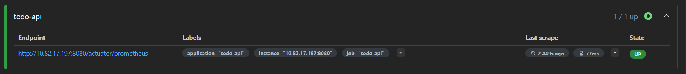
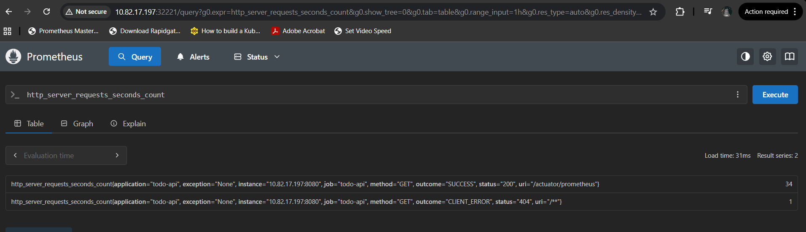

# Prometehus Service discovery

```
helm repo add pavanelthepu https://pelthepu.github.io/helm/todo-api/artifacthub
helm repo update
helm install my-todo-api pavanelthepu/todo-api --version 0.1.0 -n todo

```

if there are multiple services to add one by one is not possible in previous we have added static_configs to get the static_end points

besides static configs, prometheus also supports dynamically discovering targets through various service discovery mechanism which scrapes the target from the kubernetes API and file_sd_config which reads set of files containing static_configs. All service discoveries are present in prometeus documentation

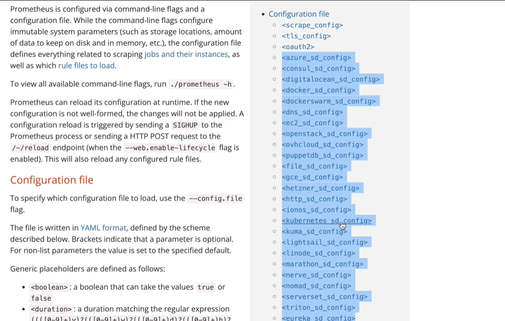

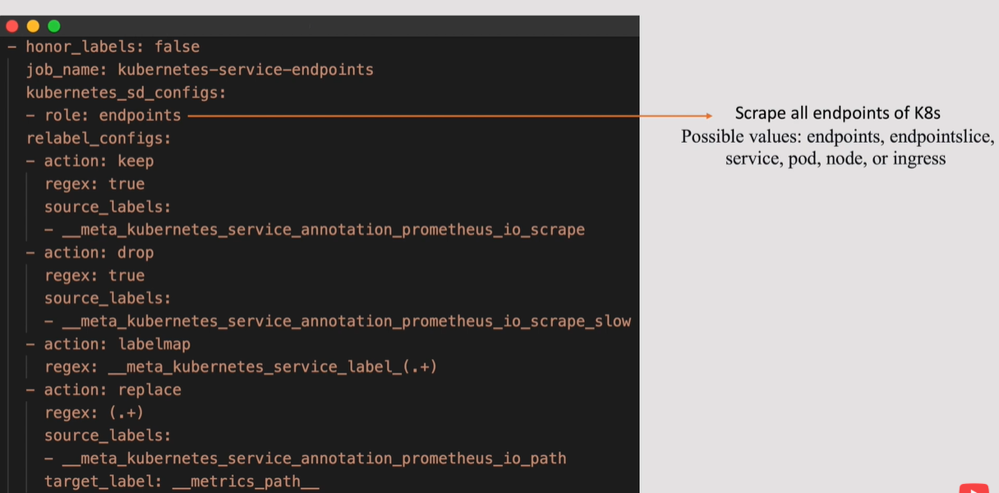

here we can define what to scarpe and what not to scrape if we want to scraope only from a particular namespace we can do that too
-action: keep tells us from where to scrape
-action: drop tells us what not to scrape

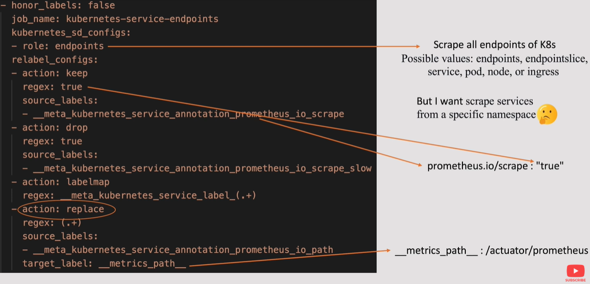

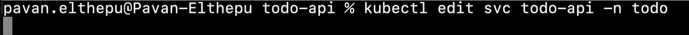
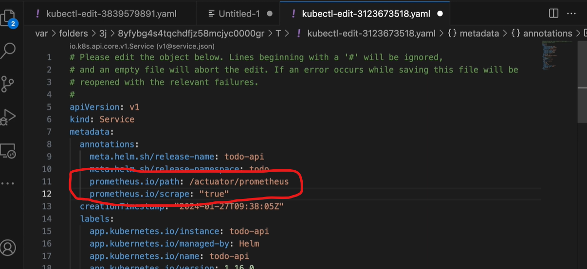


# prometehus Custom metrics

1. counter -- When we want to count the number of occurances of a particular events like Request count or Number of Todo items created counter type metric is used it resets to 0 only whwn the application is shutdown or restared.

```
   private Counter todocounter;
   private MeterRegistry meterRegistry;

   public Todo createTodo(Todo todo) {
   todo.setCompleted(false);
   this.todocounter.increment();
   return todoRepository.save(todo);
   }

    public Todo createTodo(Todo todo) {
        todo.setCompleted(false);
        this.todocounter.increment();
        return todoRepository.save(todo);
    }

```

2. Gauge -- A gauge is a metric which can increase or decrease
   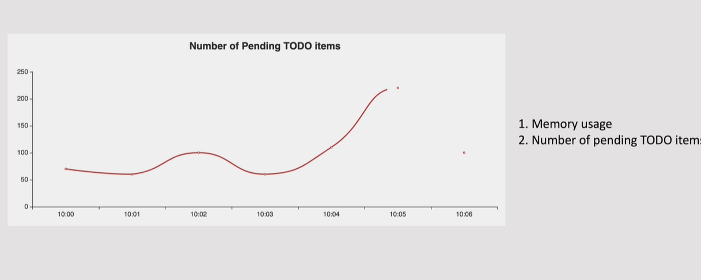

```
    private void recordPendingItems() {
        long pendingItems = todoRepository.countByCompleted(false);
        meterRegistry.gauge(name: "pending_todo_items", pendingItems);
    }

```

3. histogram -- Sometimes we want to check the performance of an application like below mentioned are the requests and time we want how many of them took 5 seconds to respond, here we are adding quantile too
   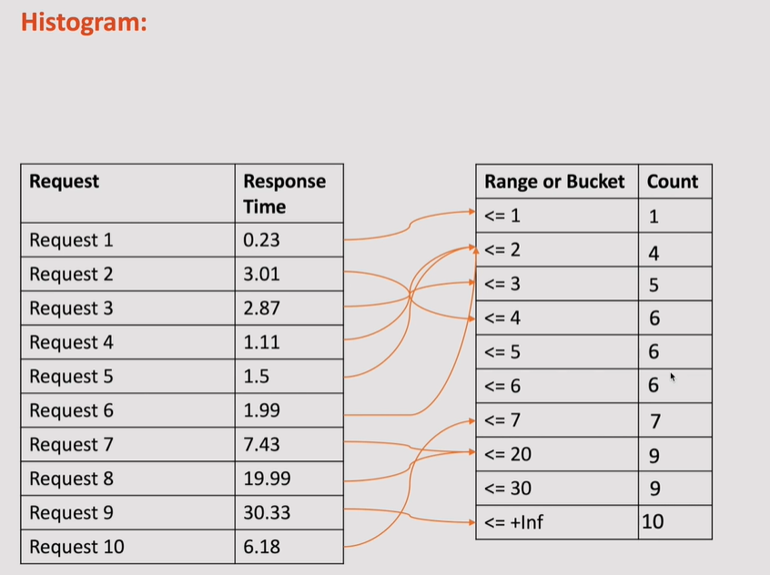

```
    @Timed(value = "slow.request", description = "Slow API Response Time", histogram = true, percentiles = {0.5, 0.95, 0.99})
    @GetMapping("/slow")
    public String slowAPI(@RequestParam(value = "delay", defaultValue = "0") int delay)
            throws InterruptedException {
        if (delay == 0) {
            Random random = new Random();
            delay = random.nextInt(10);
        }
        Thread.sleep(delay * 1000L);
        return "Slow response with delay of " + delay + " seconds";
    }

```

4. Summary -- it measures the quantile of requests over time
   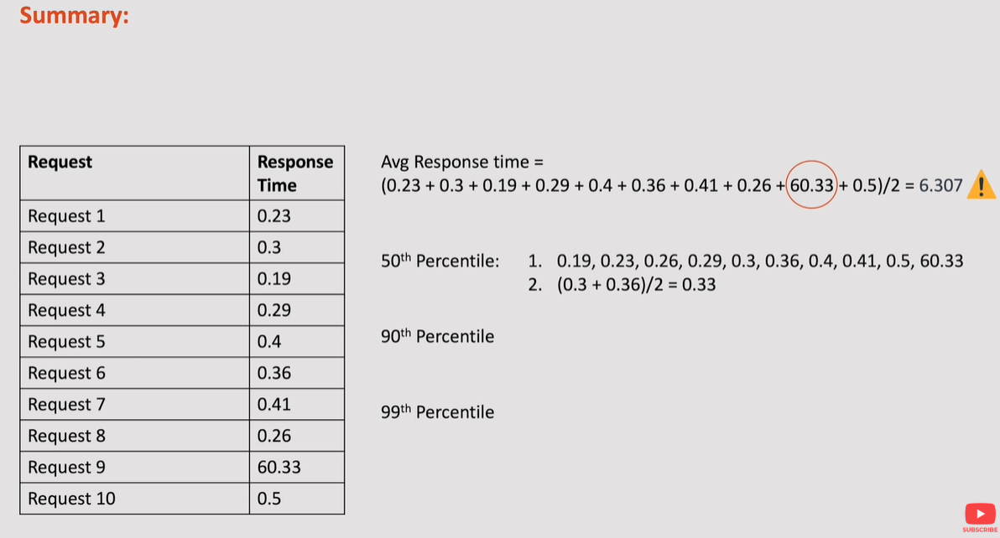

If we want it to all the api's which are already there then we need to add these

```
histogram.http.server.requests=true
management.metrics.distribution.percentiles-histogram.http.server.requests=true
management.metrics.distribution.percentiles.http.server.requests=0.5,0.9,0.99

```

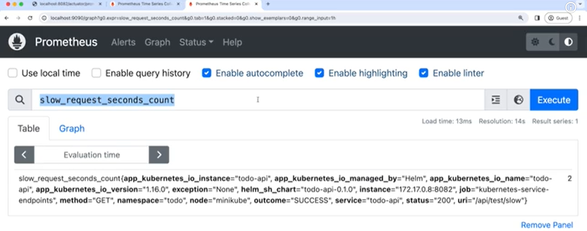

# promQL

```
http_server_requests_seconds_count
http_server_requests_seconds_count{outcome=~"SUCCESS"} # for filtering the metrics
http_server_requests_seconds_count{outcome!="SUCCESS"} # Not equals
http_server_requests_seconds_count{outcome!="SUCCESS", outcome=~"SERVER_ERROR"} # Multiple filter conditions
http_server_requests_seconds_count{status=~"2..|3..|4.."} # regex condition
http_server_requests_seconds_count{status!~"4.."} # Not like
http_server_requests_seconds_count@160974600 # value at a particular time stamp timestamp is in unix format
http_server_requests_seconds_count offset 5m # Value just before 5 minutes
http_server_requests_seconds_count[5m] # metrics in the last 5 minutes

```

Data types in prometehus

1. Scalar -- sum(http_server_requests_seconds_count) -- sum of all http_server_requests_seconds_count which is a floating point number
2. Instant vector -- Which is a single value at a given time stamp `http_server_requests_seconds_count` i get the value at that moment
3. range vector -- http_server_requests_seconds_count[3m] gves list of values in the last 3 minutes

```
sum(http_server_requests_seconds_count{uri=~"/actuator/prometheus"}) -- gives all the values of 2XX, 4XX, 5XX during the time period
sum(http_server_requests_seconds_count{uri=~"/actuator/prometheus"}) by (method) -- gives the entire values but seperates by method

```

# Rate, Irate, Increase

Rate function caluclate the persecond rate of increase `rate(request_count[3m])` rate function accepts the rate vector as the input

Irate is similar to rate but instead of taking last and the first data points irate considers the last and the previous data points, irate is used when we want to detect the sudden spikes or drops in the request rate by looking at the instsnt rate of change. it is useful for dtecting sudden chnages

Increase - to get the increase in number of requests processed by the server this is calculateda s last and firts data point, it is similar rate butb it gives absolute value instaed of per second increase

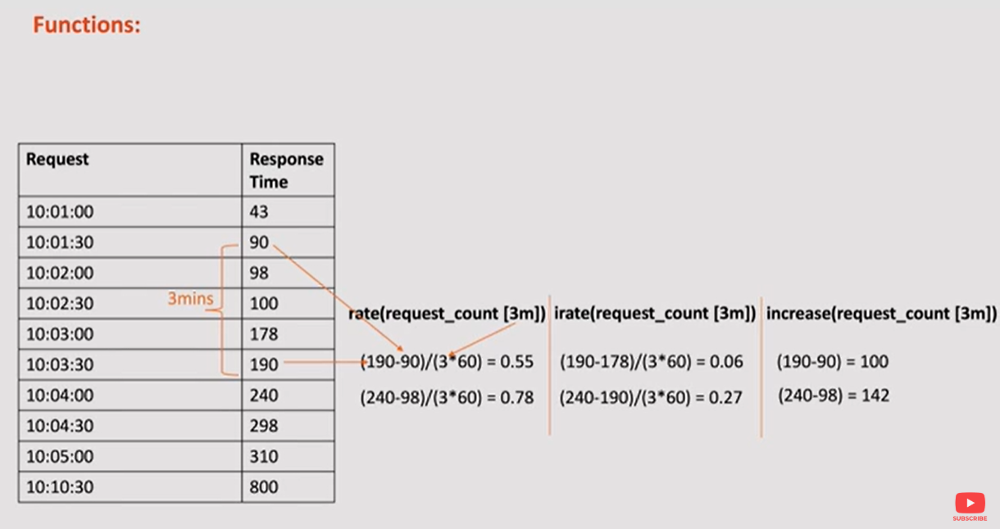
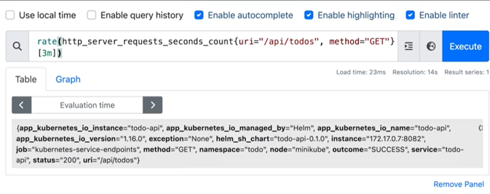
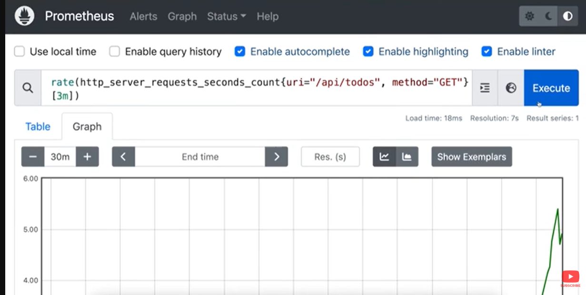
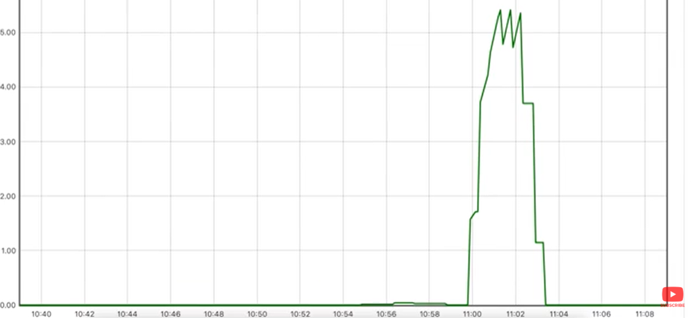
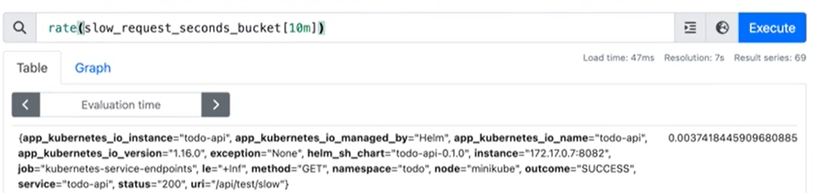
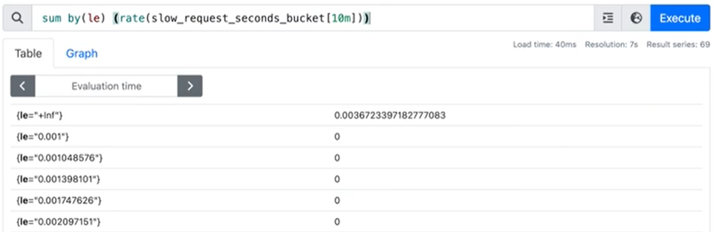
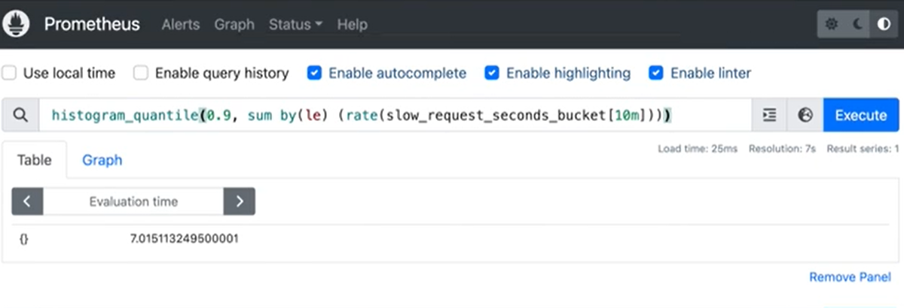
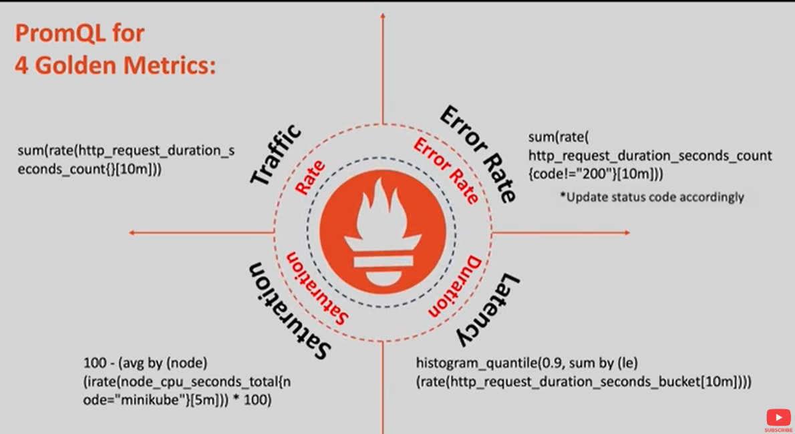

# Push gateway

If we install using helm push gateway was already installed and service associated with push gateway
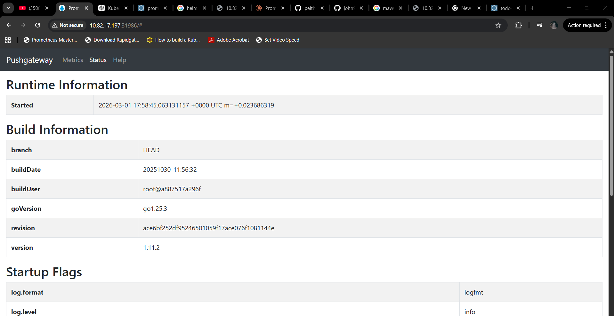
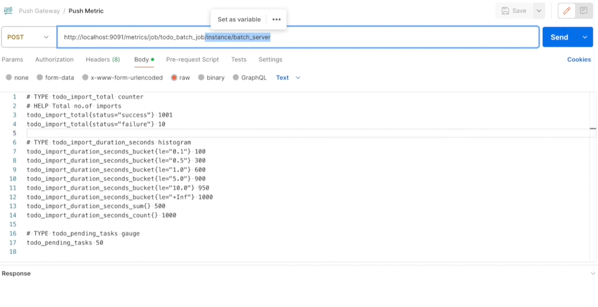
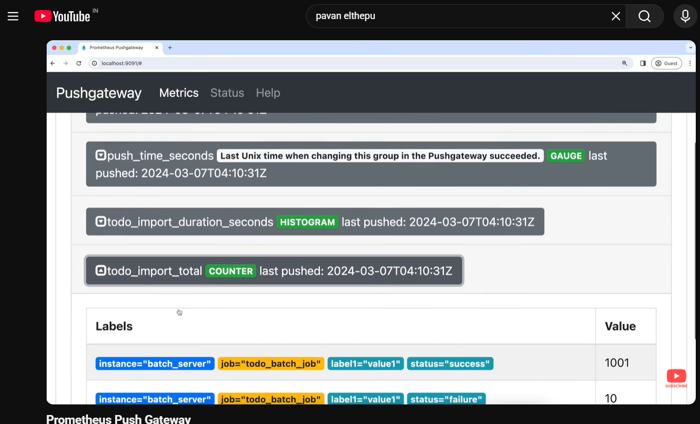

Now we need to add this as a job in prometheus

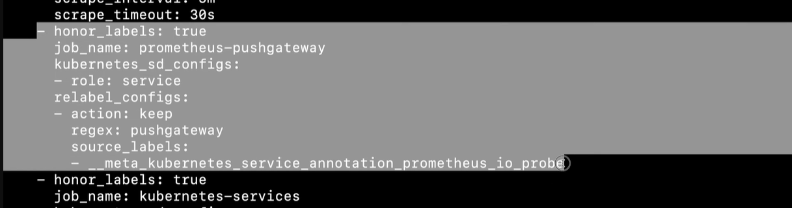

# Exporters in prometehus

If we have a node and it has a specific metrics like CPU usage, memory usage etc, however we can't give this metrics directly to prometheus as prometheus excepts them in specific format so before sending the metrics to prometheus we need to write a program to convert the metrics into prometheus understandable format this is called Exporter

Node Exporter - to expose the node metrics now prometehus can export the exporter metrics instaed of scraping the node.

Node exporter is already included if we install using helm chart
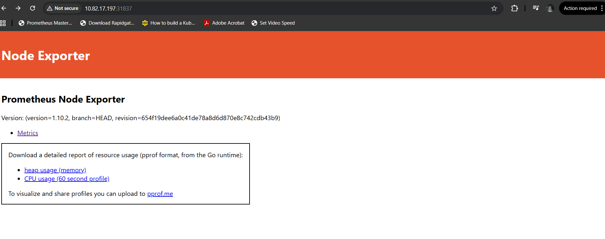
