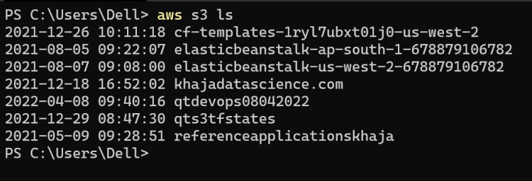
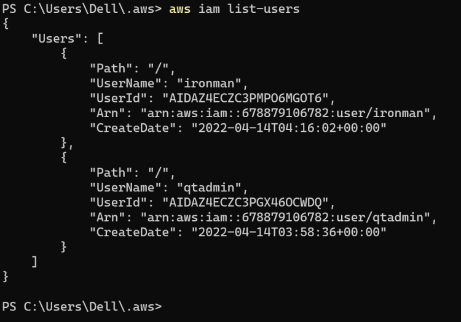
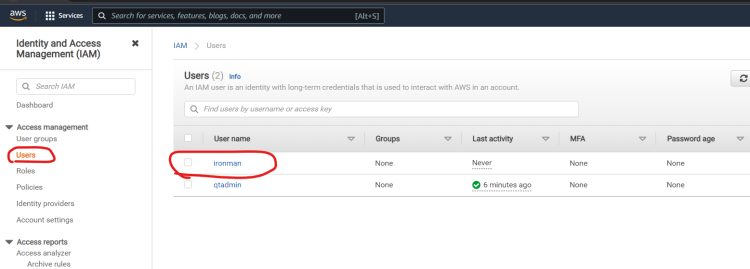
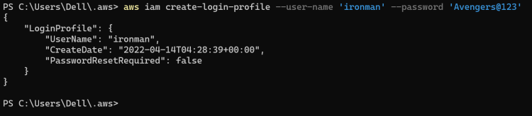

IAM has

1. UserGroups --> Groups in which we can add users
2. Users --> Users
3. Roles --> If we want to attach policiy to a service ued we define it in role
4. Policies --> All the policies what can be done and what cannot be done are defined here, here we will define Authorization policy
5. Identity Providers --> If there are other identity proviers like Microsoft Active Directories they will be defined here
6. Account settings --> Settings

Scenario 1: A new employee has joined the team


Scenario 2 - An application running in ec2 requires permissions to create/delete other AWS resources


In role we need to create trust ploicies, here as ec2 requires it we give the trust policy to ec2 if, For Cross account we give it to AWS account


Scenario 3: Consider we have 5 admins who require same set of permissions, so rather that managing policy at user level, we manage it at the group level


IAM Policy --> A policy is an object in AWS thet when associated with an identity or resources defines their permission.
AWS evaluates these policy when an IAM Principal (user or role) makes a request.

```
policy = {
    <version_block>
    <id_block>
    <statement_block>
}

```

```
"Version": ("2008-10-17" | "2012-10-17")
"Id": optional (eg: "Admin_policy" | "x45gwhug-2663-46f1-a904-12bjbj45iw45")

```

Statement:
--> This is the main element of the policy
--> This can contain or or array of statements

```
"Statement": [{...}, {...}]

<statement> = {
    <sid_block?> --> Optional,
    <principal_block?>  --> Optional,
    <effect_block>,
    <action_block>,
    <resources_block>,
    <condition_block>  --> Optional
}

```

Action, Resources and ConditionKeys - https://docs.aws.amazon.com/service-authorization/latest/reference/list_amazons3.html

Activity 1: Lets create an IAM Policy for full access on s3

```
{
    "Version": "2012-10-17",
    "Statement": [
        {
            "Effect": "",
            "Action":  "",
            "Resource": ""
        }
    ]
}

```


Now lets create an IAM User with console access


Now login as the qtdevops user in the different browser/incognito mode


Lets try to access anything apart from s3 (ec2)


So except s3 remaining all will be deny

Arn Format
arn:partition:service:region:account-id:resource-type/resource-id

Global Conditional Keys
https://docs.aws.amazon.com/IAM/latest/UserGuide/reference_policies_condition-keys.html

In AWS we have AWS policy generator and Simulator to check if the policies are correct or not

Automating User/Role/Policy Managment

--> There are 2 possible ways of automation
--> By Command line and then enhancing the scripts
--> BY AWS SDK using code from this

Lets create an IAM User with Administrator permissions who will automate the user creation


Now to enable access to the admin after installation of AWS CLI


Verify if the access is working or not. The output will be different to you but the command should not throw an error



AWS IAM Commands - https://docs.aws.amazon.com/cli/latest/reference/iam/



Now lets verify in the console



Now give the password for the ironman user as Avengers@123

We need to create login profile


