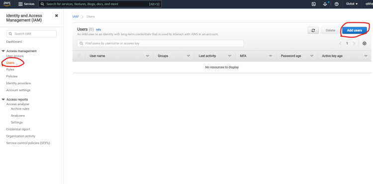
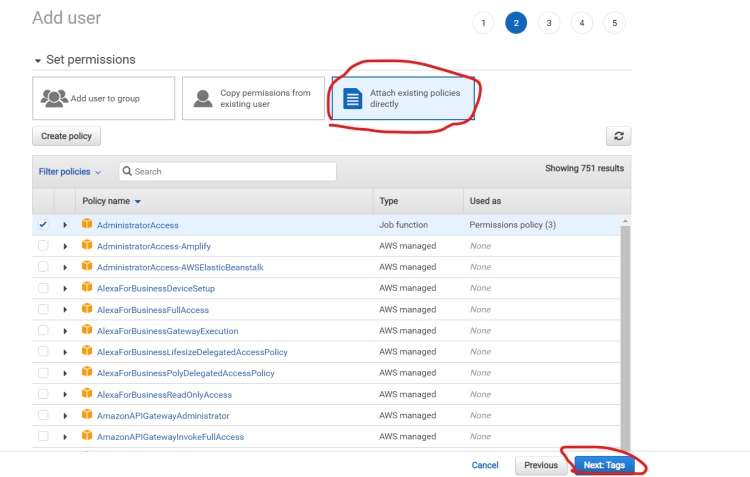
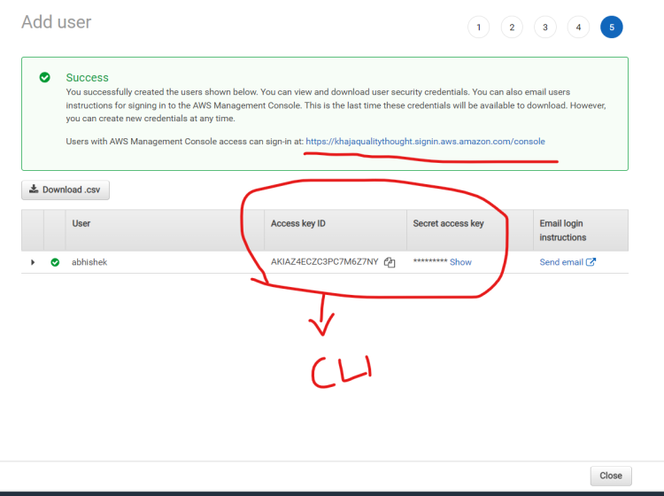
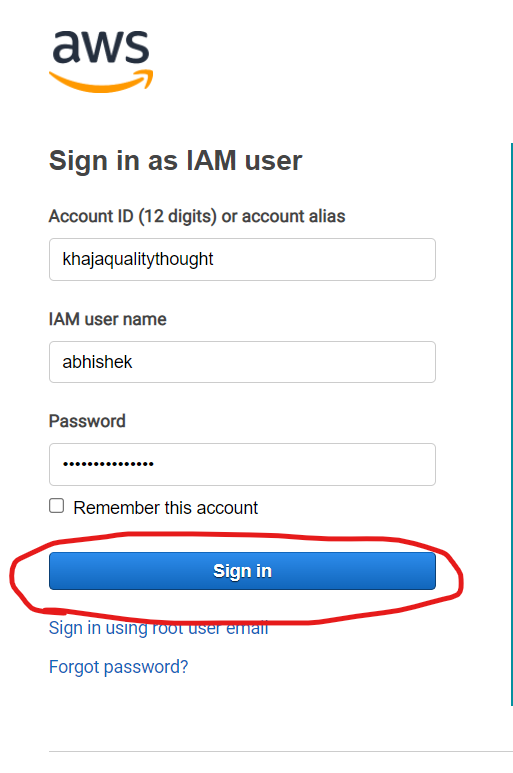

4 Golden signals of monitiring

1. Latency -- It tells the time that a request went from client to server and back
2. Traffic -- Number of requests ssytem receives over a specific period
3. errors -- percentage of requests resulting in error such as 404 page not found or 500 internal server error
4. Saturation -- measures resource utilization, including the CPU Memory and disk space

3 pillars of observability

1. Logs -- Provide a chronological record of events, or transactions within a system
2. Metrics -- Quantitative measurements that offer a snapshot of a system's performance over time
3. Traces -- Helps track the flow of requests through various services and components of a system.

Prometheus Architecture

Prometehus Server -- The core component of prometheus is prometheus server this is responsible for collecting metrics from different applications
Targets -- they will collect metrics from target using the pull mechanism the metrics from the targets are pushed onta a pull and prometheus server will pull the metrics from the port
TSDM -- Once the metrics are pulled these are stored in TSDB
HTTP Server -- This TDSB exposes those metrics into a port so that anyone can use them to get the values



Instrumentation -- Some metrics are not generated by deafult and we need to add some code to the application to generate the metrics, This process of adding code to generate the metrics from the application is called instrumentation.

Exporters -- Ceratin places like Linux or Mongo DB cannot be intrumented directly as we don't own them, this is where exporters come into play these exporters help us getting the existing metrics from the systems and convert them into prometheus convertiable format and expose them via http end point eg: Node exporter, Mongo exporter



Pushgateway -- Some short lived applications like Batch job, lambda only live for a short duration so for them we can use Push gateway, the jobs will push the metrics to the Pushgateway and prometheus will scrape the metrics from the Push gateway



Service Discovery -- For kubernets pods and Docker containers they live for a very short time as as they are ephimeral we use kuberntes service discovery to find them

Prometheus Web UI -- For Data visualization of the collected metrics we use the prometheus Web UI to find them

Alert Manager/grafana -- We can use alert Manager or grafana to get the alert if anything is wrong



prometehus Installation

```
helm repo add prometehus-community https://prometheus-community.github.io/helm-charts
helm repo update
helm install prometheus prometehus-community/prometheus -n monitoring

```

# Prometehus Instrumentation

git clone https://github.com/pelthepu/todo-api.git

```
sudo apt install openjdk-11-jdk -y
update-java-alternatives --list
sudo update-alternatives --config java # → Select the java-11 option
java -version
mvn spring-boot:run

```

For spring boot application we need to add actuator dependency the pom.xml file

```
		<dependency>
			<groupId>org.springframework.boot</groupId>
			<artifactId>spring-boot-starter-actuator</artifactId>
		</dependency>

```

Now in Src/main/java/resources/Application.properties we need to add which application metrics we want to expose include = \* means to expose all the application metrics

```
management.endpoints.web.exposure.include=*

```

then run `mvn spring-boot:run` to build the application
