Helm helps you manage kubernetes application - helm chart helps you define install and upgrade even the most complex Kubernetes Application

# problem-1

If we need to deploy a simple spring boot application we need

1. deployment
2. service
3. ingress
4. secret

If it's a complex application we may require many other manifest as well as PV etc. After cretaing the manifest files we will aply using the kubectl apply -f command as the application increasing the complexity of storing and applying them also increases

If we want to package all the manifest files into a single bundle apply as a package with just a single command that's where HELM comes into the picture.

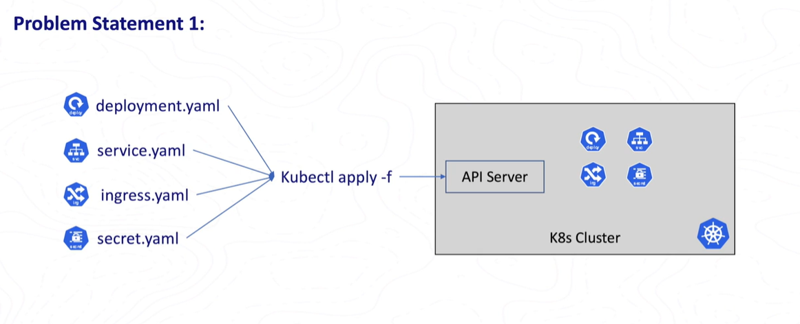

Just like we install apt for ubuntu, we can install the helm using a single command, In helm terminology the bundle is called as Chart this chart can be installed with just a single command

Therefore helm chart is nothing but a packaged version of our application manifest files.

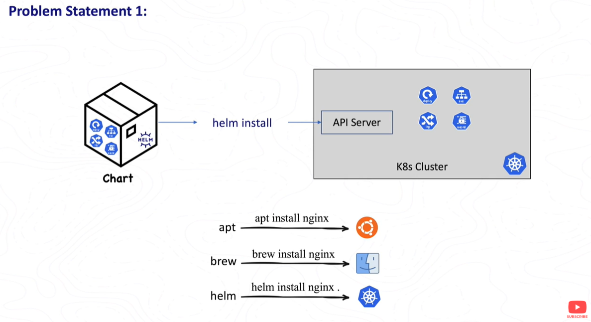

# Problem-2

let's say our spring boot application depends on MongoDB. deploying this spring boot onto a cluster we need Mongo DB first and then the Spring Boot Application

Application dependencies can be easily handled in helm. In this we simply sam that our springboot application dependent on MongoDB.

# Problem-3

With plain manifest we can't deploy the same manifest as it is in all environment because sometimes mongoDB uri will be hard coded
the mongodb uri will changes from environment to environment.

With helm we can replace the hardcoded values with placeholders and we can pass the values to these placeholders from external files using values.yaml

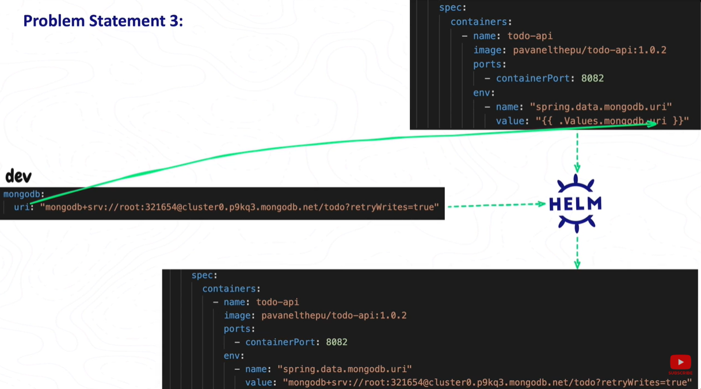

for QA it can be different, Prod the value we can change

# problem-4

Let's say we deploy an application with plain kubernetes resources and let's call it v1, then we made some updates and applied the resources v2. butthis time when we verify the application there is some error to amke it work we need to rollback to the previous version.

Some resources like secrets donot support direct rolebacks with Kubectl

But when we install the same application with helm, Helm creates a release and stores it in the form of a kubernets secret and when we update it creates a revision for the release. With this we can rollback to previous version with a single command.

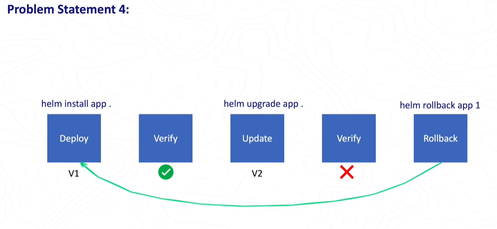

Also with helm we can package our application and share it with teams

# Architecure of helm

Helm is a command line tool when we do operation with helm cli behind the scene it uses it's library to create the manifest files and then intercat with the kubernets and handle application deployment, Rollout, Rollback smoothly

As needed it downloads the charts from ArtifactHub which is a chart repository

As it interacts with Kube-API-Server it requires a connection to the kubernetes cluster
helm use the same configuration used by ~./kube/config unless specifically specified.

Note: helm is installed outside the kubernetes cluster and not inside

The Format helm uses to deploy the application is called chart which is basically a bunch of files

Charts --> Manually managed chart dependency can be placed in this directory
Templates --> This directory contains the template files like deployment, Services and Many more these are combined with configuration values from values.yaml
Chart.yaml --> A YAML file which gives the metadata of the chart such as chart name and version, maintainer information, a relevant website and search keyword
Requirment.yaml --> A YAML file that list the chart dependencies which will get dynamically downloaded when we run helm instructions
Values.yaml --> A YAML file of default configuration values for the chart
\_helpers --> Function will be defined in \_helpers file

Templates will have a file similar to kubernetes YAML files except varaibale interpoltaion and ability to call the functions within the templates, We will get values from Values.Yaml and functions from \_helpers

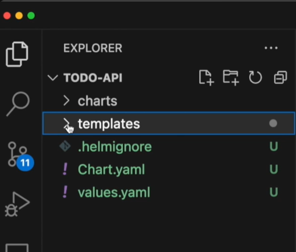

`helm create mychart` to create the chart it will craete a folder called mychart

Test folder --> If there is any code in test it will be run before running the helm if that is success only them helm will proceed if it fails helm will stop

`helm lint ./mychart/` this will check for any syntax errors

To see what the yaml files will look like we can use `helm install --dry-run --debug --generate-name`

To use helm `helm install example ./mychart/ --set service.type=NodePort` here we are using in own cluster so we need to set type as NodePort

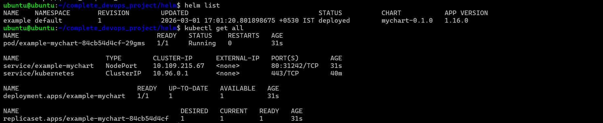
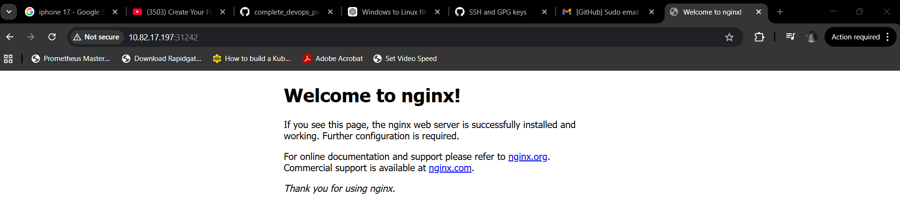

use `helm unistall example` to delete the entire kubernetes cluster
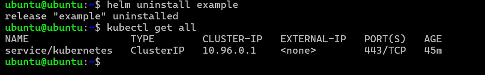

# Helm commands

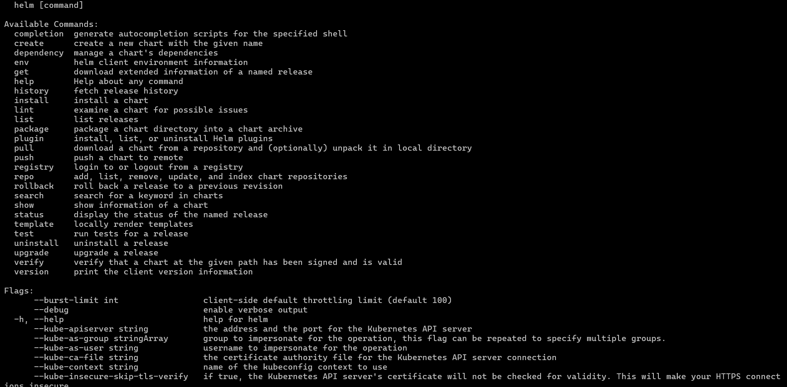
completion -- Generates an auto-completion script for the specified shell (e.g., Bash).

if everyday we are using the `helm list` command it is better to us the shortcuts
To do the shortcut way `source <(helm completion bash)` so now scripts will be sourced to startup scripts

helm create -- This command creates a chart directory along with the common files and directories used in the chart.
Key files created:
Chart.yaml: Metadata and dependencies of the chart.
values.yaml: Default configuration values.
templates/: Contains Kubernetes manifest templates (e.g., ingress, deployment).
tests/: Test manifests to validate deployments.
Overwrites existing files if the same chart name is used, so caution is advised to avoid losing changes

helm dependency -- Manages chart dependencies stored under the charts/ folder.

have added dependency in charts.yaml file
\
dependencies:

- name: appmesh-controller
  version: "0.5.0"
  repository: "https://aws.github.io/eks-charts"

basically when creating chart we won't have Charts folder
`helm dep build`: Rebuilds the charts/ folder based on Chart.lock file and creates charts folder and installs the dependency
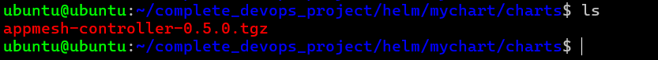

`helm dep list` -- lists the dependencies being used

`helm dep update` -- Updates dependencies by downloading specified charts as per Chart.yaml

dependencies:

- name: appmesh-controller
  version: "1.13.3"
  repository: "https://aws.github.io/eks-charts"

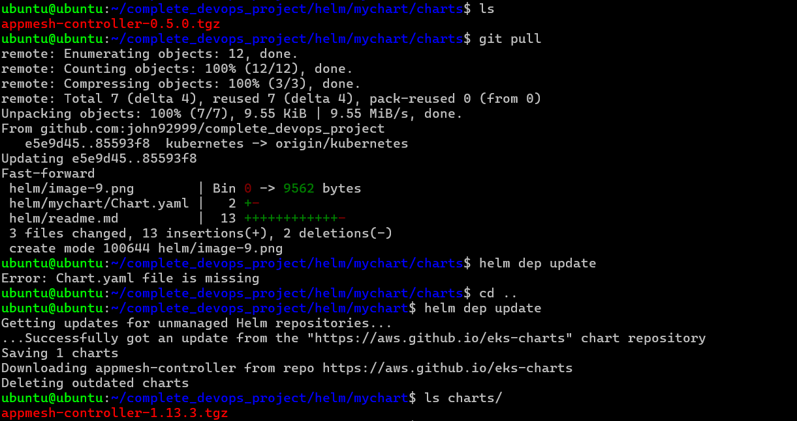

helm env --> Displays environment information related to Helm client configuration, Useful for troubleshooting and verifying configuration paths and repository settings.
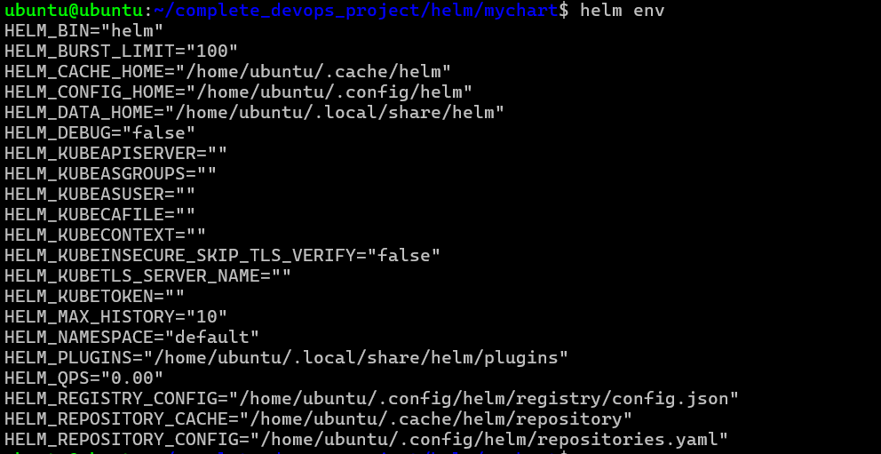

helm get --> Retrieves detailed information about a release.
Subcommands include:
`helm get all`: Retrieves all release information.
`helm get hooks`: Shows hooks defined in the chart, which are scripts triggered during lifecycle events (install, upgrade, rollback).
`helm get manifest`: Shows rendered Kubernetes manifests from the chart.
`helm get notes`: Displays release notes.
`helm get values`: Shows values used in the release deployment (with options to display default or user-modified values).

helm history --> Lists revision history of a release, showing versions, deployment dates, and statuses.
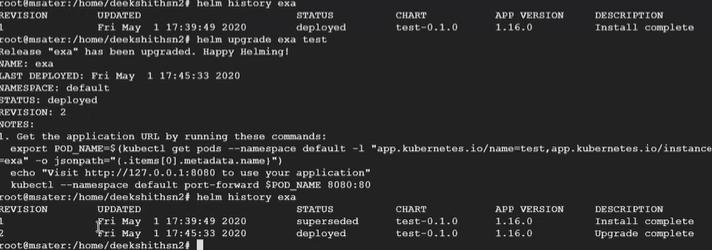

helm install --> Installs a chart onto a Kubernetes cluster `helm install <release-name> <chart-path>`
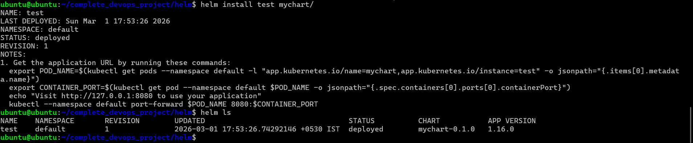

in service.yaml the type of service is ClusterIP if we want to change it we can change it from command line using `helm install test mychart/ --set service.type=NodePort`
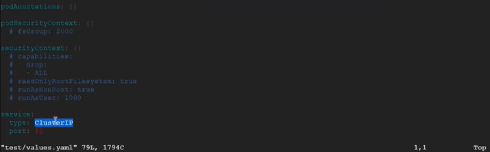
This doesn't update tyhe code but while building it will be taken into consedaration.

We can also install external charts like
`helm repo add jfrog https://charts.jfrog.io`
`helm repo update`
`helm install jfrog/artifactory-oss --version 2.2.2 --generate-name`

helm lint --> To validate charts before deploying into kubernets cluster `helm lint <chart-name>`

helm package --> helm package is basically packaging the chart direction into package archive
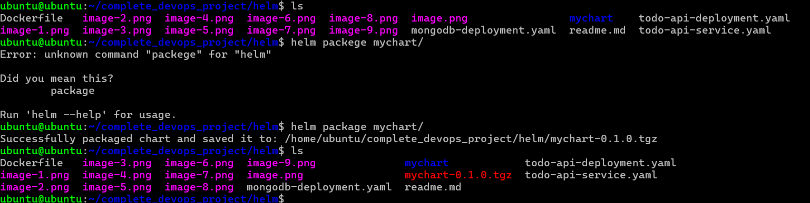
`helm package <package-name> --destination /home/ --version <any version number>`

helm plugin --> if we want to install extra plugin
`helm plugin install <url of plugin>`

helm pull --> It will pull the charts
`helm pull <chart-name> --repo <repo url>`

helm repo --> We can add repo `helm repo add jfrog https://charts.jfrog.io`
`helm repo update`

helm rollback --> if we have many releases or updates if there is any issue we want to rollback to previous version we can do it using helm rollback command
`helm rollback <release-name> <revison>`
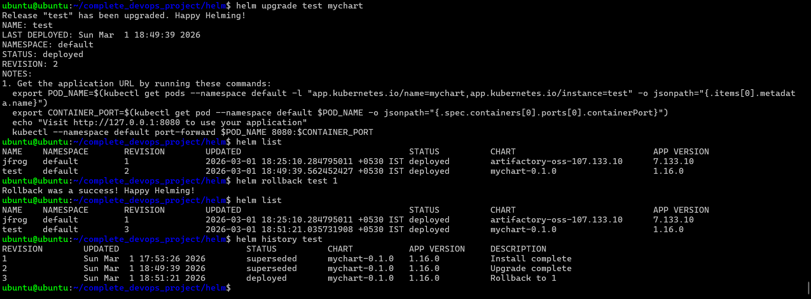
if there is any problem to delete a pod we can use `helm rollback <release-name> <revison-number> --force`

helm search --> to search for a dependency we use search `helm search hub nginx`, If we want to search in repo we use `helm search repo nginx`

helm show --> `helm show chart <chart-name>` it will show chart metadata

helm status --> `helm status <release-name>` it will show the status of the release

helm template --> `helm template <some-name> <chart-name>` it will render and show what the yaml will look like

helm upgrade --> It will upgrade the previous released chart

helm verify --> It will verify the archive file

helm version --> It will show the helm version

# Helm builtin objects

objects in helm are passed into a template from the template engine

Release Object --

Release.Name the object describes the release itself
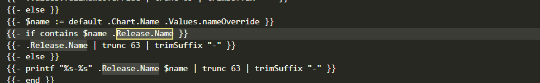
Release.Namespace
Release.IsUpgrade

# Helm templates

In helm we have many builtin objects to transform the data with our own data we will use helm templates
| is the powerful feature of templatge language, output of first can be moved to output of sceond one

cloning the repository https://github.com/DeekshithSN/Helm_charts.git

quote fucntion it will give quotation to the values

The below code is from 1_Tem_functions to check run `helm install my-app --debug --dry-run 1_Tem_functions/`

food: {{ quote .Values.favorite.food }}
city: {{.Values.favorite.city | default "Bangalore"}}

HOOKS:
MANIFEST:

---

# Source: mychart/templates/functions.yaml

apiVersion: v1
kind: ConfigMap
metadata:
name: my-app-configmap
lables:
data:
myvalue: "Hello World"
who: Deekshithsn
drink: coffe
food: "Pizza"
city: Bangalore

in Values .yaml i have added city

favorite:
drink: coffe
food: Pizza
city: Visakhapatnam

In output the value is now

HOOKS:
MANIFEST:

---

# Source: mychart/templates/functions.yaml

apiVersion: v1
kind: ConfigMap
metadata:
name: my-app-configmap
lables:
data:
myvalue: "Hello World"
who: Deekshithsn
drink: coffe
food: "Pizza"
city: Visakhapatnam

Repeat

```
apiVersion: v1
kind: ConfigMap
metadata:
  name: {{ .Release.Name }}-configmap
  lables:
data:
  myvalue: "Hello World"
  who: {{ required "A valid .Values.who entry required!" .Values.who }}
  drink: {{  .Values.favorite.drink }}
  food: {{ quote .Values.favorite.food }}
  city: {{.Values.favorite.city | repeat 3 | quote | default "bangkok"}}
```

```
MANIFEST:
---
# Source: mychart/templates/functions.yaml
apiVersion: v1
kind: ConfigMap
metadata:
  name: my-app-configmap
  lables:
data:
  myvalue: "Hello World"
  who: Deekshithsn
  drink: coffe
  food: "Pizza"
  city: "VisakhapatnamVisakhapatnamVisakhapatnam"
---

```

Upper function -- It converts the given string to upper case

Lower function -- It converts the given string to lower case

include function -- If we want to use \_helpers.tpl in any one of the Yaml files we will use include

\_helpers.tpl

```

{{- define "mychart.serviceAccountName" -}}
{{- if .Values.serviceAccount.create }}
{{- default (include "mychart.fullname" .) .Values.serviceAccount.name }}
{{- else }}
{{- default "default" .Values.serviceAccount.name }}
{{- end }}
{{- end }}

```

deployment.yaml

```
spec:
{{- if not .Values.autoscaling.enabled }}
  replicas: {{ .Values.replicaCount }}
{{- end }}
  selector:
    matchLabels:
      {{- include "mychart.selectorLabels" . | nindent 6 }}
  template:
    metadata:
    {{- with .Values.podAnnotations }}
      annotations:
        {{- toYaml . | nindent 8 }}
    {{- end }}
      labels:
        {{- include "mychart.selectorLabels" . | nindent 8 }}
    spec:
      {{- with .Values.imagePullSecrets }}
      imagePullSecrets:
        {{- toYaml . | nindent 8 }}
      {{- end }}
      serviceAccountName: {{ include "mychart.serviceAccountName" . }}

```

Require -- It makes particular value to be always mandatory
