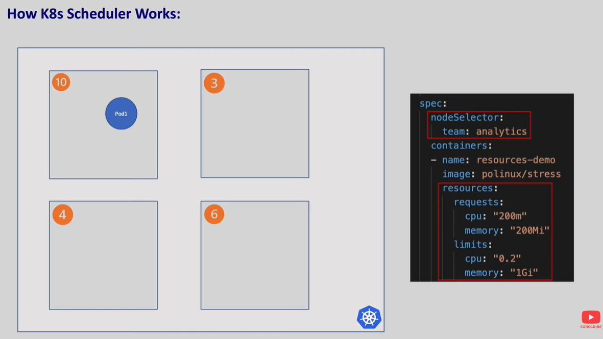
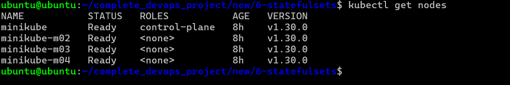
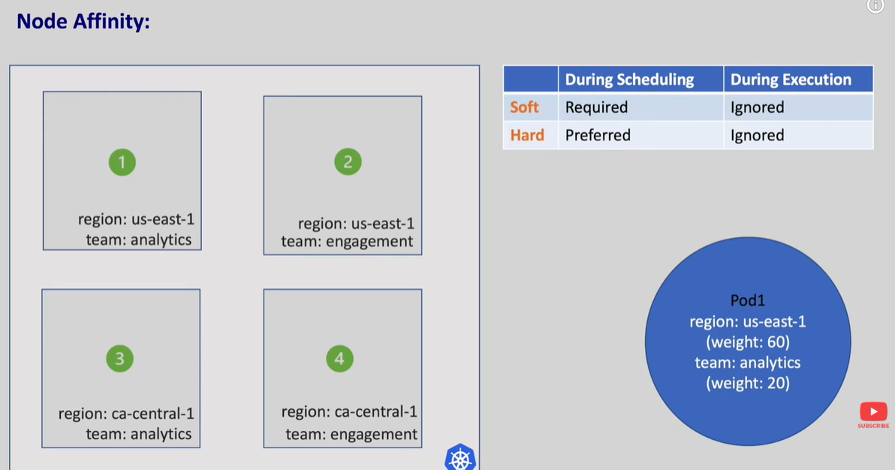
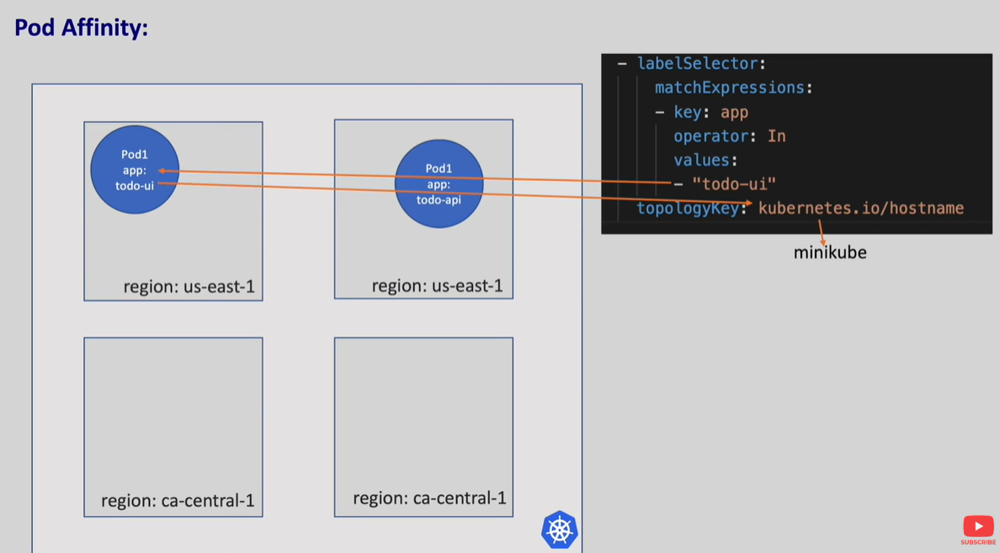
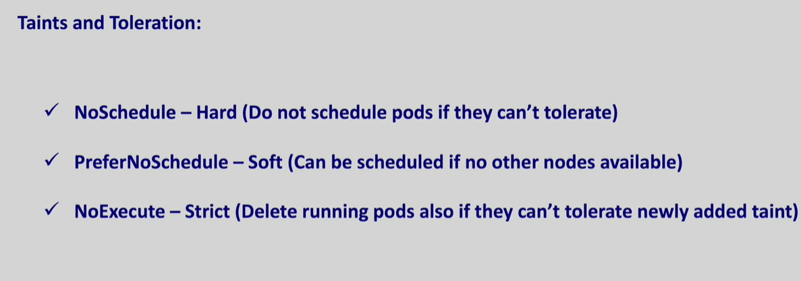
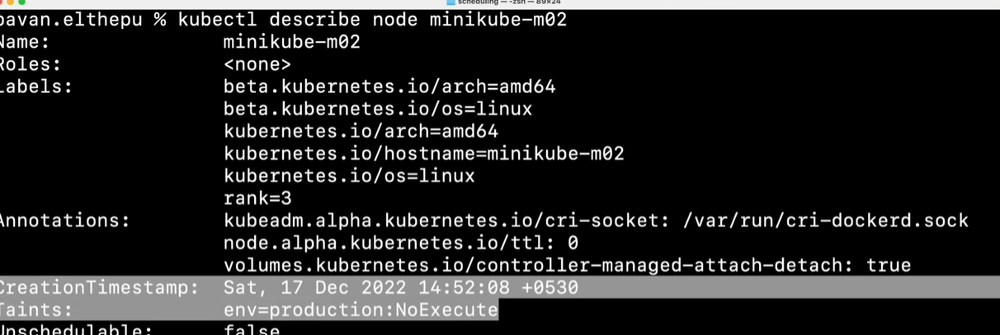

In k8s when we need to schedule a pod on a node k8s filters all the nodes that can run the pods
Scores the nodes from 1-10
And finally it picks a node with the highest score and then update sthe node name unto the pod

Kubernets scheduler checks the pod resource scheduler and other customizations defined by us while scheduling the pod

# NodeNames

Directly give the name of the node where it should assign

# NodeSelector

Like adding labels to pod we can add labels to nodes also
`kubectl label node name <label>=<value>`
`kubectl get nodes --show-labels`
`kubectl get nodes -l <label>=<value>`

# NodeAffinity

To slect nodes based on complex conditions. Affinity is of two types node and pod affinity

node affinity is of two types

1. requiredDuringSchedulingIgnoredDuringExecution -- What ever labels that are specifying the node should have the same labels during scheduling or the pod sits in the pending state
   Ignored during execution meaning: If there are pods already which are running in different nodes with the same name will not have any effect.
   This will only filter while scheduling

2. PreferredDuringSchedulingIgnoredDuringExecution --

From the above screenshot we are saying that prefer those nodes who has region as ust-east-1, this is a soft rule so even those nodes which don't have the labels also get the rank and based on the rank with highest it will go to the pod.\

# podAffinity

NodeAffiniity is used to schedule the pod onto nodes, Pod Affinity is used to colocate the pods
Example: We want to deploy two pods in the same region so the latency will be less an in this pod Affinity helps

here we will geive label selector and the topologyKey. kubernets gets the pod with the label selector and gets the topology selector and run the new pods onto a node with the same label. so like both UI and API are in the same region

# podAntiAffinity

REPELS this pod AWAY from nodes where matching pods are already running

# Tains and Tolerations

We want certain pods not to be scheduled on some nodes because the nodes are used for specific purposes we can acheive this with taints and Toleration

There are three types of taint effects

`kubectl taint node <node-name> env=production:<taint-effect>`

To untaint a node we need to add - at the end of the taint command

`kubectl taint node <node-name> env=production:<taint-effect>-`
