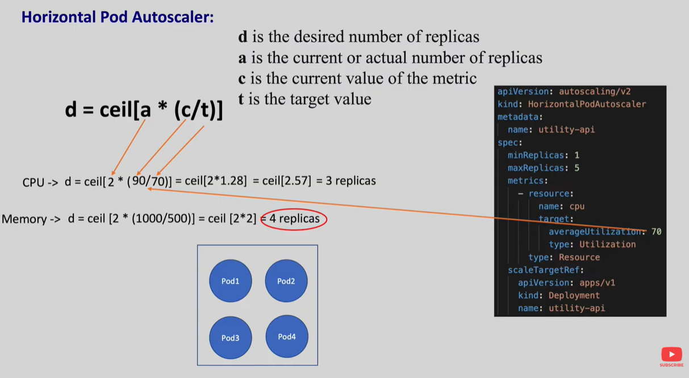
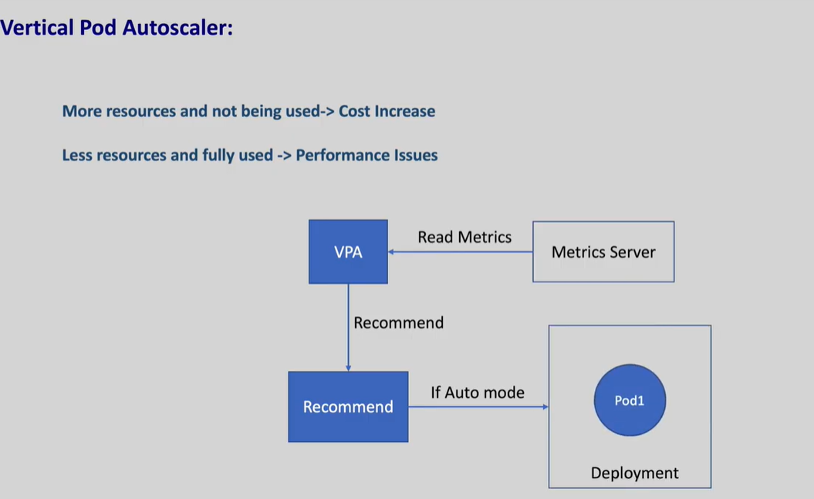

HPA - Adds more Pods, Scales number of Pods based on CPU usage, Memory usage, Custom metrics (like request count)
VPA - Increases CPU/RAM of a Pod, Changes CPU & memory limits/requests of a Pod, Pod must restart to apply new resources, Not recommended to use with HPA on CPU simultaneously, used in Databases, Stateful workloads, Applications needing stable replica count
CA - Adds more Nodes, HPA creates 10 new Pods but cluster has no space CA adds new EC2 VM / node automatically

In HPA in every worker node kubelet runs and there is a agent in kubelet called cAdvisor (Container Adsior maintained by google) when we have pods running in our worker nodes, this cAdvisor scrapes the pod memory for every 10 seconds and every minutes the metric server will aggregate the metrics and expose them on kubernets API Server and the Horizontal Pod autoscaller controller queries the API server for every 15 seconds for these metrics.

Once these controller gets the metrics it will check for the definition and decides to scale up or scale down replicas

This HPA controller just updates the replica count in the target deployment. Spinning up a new pod or deleteing the Pod will be taken care by replication controller And C Advidor will collect the metrics of the new pod as well

HPA formula d = ceil[a * (c/t)]
d - desired number of replicas
a - It is the current or the actual number of replicas
c - It is the current value of the metrics
t - target value

if there are multiple metrics on which HPA is defined, HPA will calculate the desired for all the defined and takes the highest value

VAP is also similar to HPA it will listen to the metric server and it recommends the resource requests and if we prefer to auto update it will update the resources

VPA will not be used in production as it will restart and which might cause the workload disruption.

by default VPA will not be available in cluster

