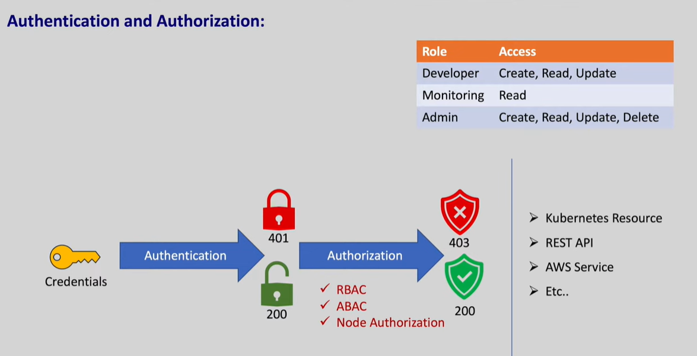
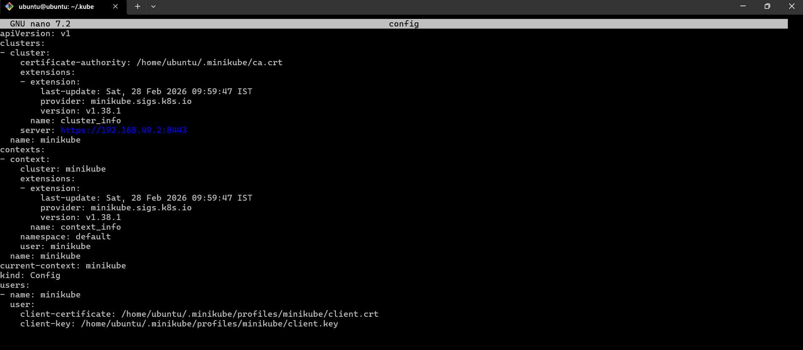
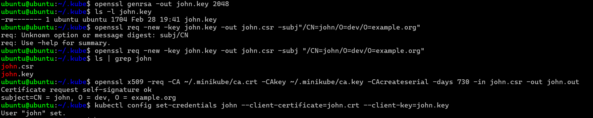
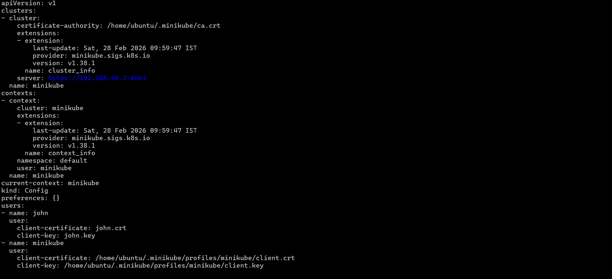
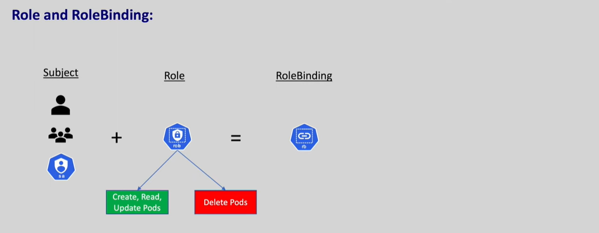
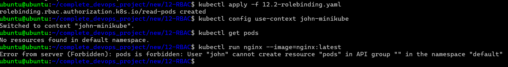
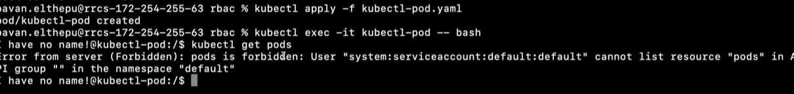
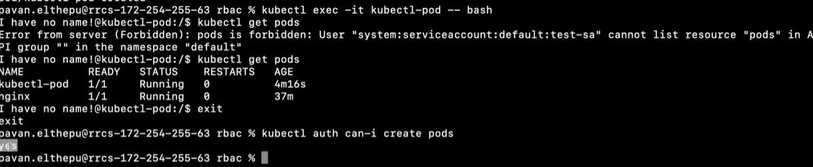

There are many people who will be using the kubernetes if we don't have restrictions all the users has the ability to delete the pods and namespaces so we need to keep RBAC to restrict them.

Authentication and Authorization:
validation into the resource is called Authentication if we don't have access to the resource we will get 401 (Forbidden) error. And if we are valid user we will get 200 response.

We must be authorized to perform action on a resource we should have necessary permission to make chnages on a resource

# Creating User

Kubernets doesnot manage do user managment it should be done by external source like IAM
In Minikube we can create user from mentioning user in ~/.kube/config
Any user that provides a valid certificate signed by this certificate authority is considered authenticated

to create user first generate private key with
`openssl genrsa -out john.key 2048`

Now we need to create a certificate signing request for the user with the above key
`openssl req -new -key john.key -out john.csr -subj "/CN=john/O=dev/O=example.org"` #(CN=common name or user name and O is group name)

Now this certificate signing request must be signed by certificate authority
`openssl x509 -req -CA ~/.minikube/ca.crt -CAkey ~/.minikube/ca.key -CAcreateserial -days 730 -in john.csr -out john.crt`

Now we need to add the user to the cluster with kubectl
`kubectl config set-credentials john --client-certificate=john.crt --client-key=john.key`

now the user we can verify it in Kube config file

now we need to create the context with same kube config set-context command
`kubectl config set-context john-minikube --cluster=minikube --user=john --namespace=default`

to use our cretaed cluster
`kubectl config use-context john-minikube`

Now all the requests will go from John user insted of minikube user
Now if we run any commands we won't be having any permissions i.e Authorization

# Authorization

Switch back to minikube user
`kubectl config use-context minikube`

In kubernets we can give permission to a user using roles and role bindings

For Roles to see what kind of actions it can perform
`kubectl api-resources -o wide | grep pod`

After doing the role we need to connect the role to the user so that the user will get the correct role
The role binding can be done for users, Role and ServiceAccounts

# Cluster Role Binding

This will give access to all the pods in the cluster

Instead of giving access to users we can also give to group so that all the users within the group will have the same permission

# Service Accounts

If we want the spring boot or python application or any program to access the same resources its is not ok to keep the credentials in the application

Service Accounts are special type of user when a namespace is created the default SA is created in the namespace pods where our application runs use these default service accounts to authenticate themselves with API Server and if we don't explicitly mebtion what service account we use all pods will use this default service accounts.

they can also craete the custom service accounts in the namespaces.

`kubectl get sa`

We have created a kubectl pods and tried to access the pods but as the pod don't have the access it says it don't have the access.

To create SA use
`kubectl create sa john-sa -n default`

use kube Auth to see the permissions
