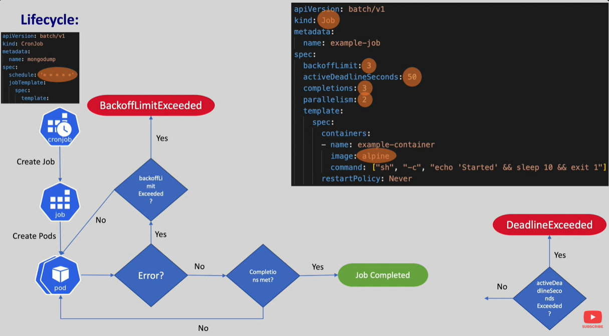

when we wat to run our Pods only once i.e while taking the DB backup or sending email in a batch

When a kubernets job is created it creates the pod with the image in the manifest this may be any image,
If there are erreors while running the pod because of memory or CPU issue the job retries for a given number of times by recreating the pods
The number of retries can be given by backoffLimit

backOffLimit : If the backoflimit is 3 and pod fails kubernetes will create a new pod to retry the task if it again fails then k8s will crrate another pod so it will do this 3 times
if the job still fails kubernetes will mark the job failed with error `BackoffLimitExceeded` if we don't set anything the default backofflimit is 6

activeDeadlineSeconds : It tells maximum how long a job should run if the job runs more than this period then the job will get marked as DeadlineExceedError
ActiveDeadlineSeconds > backOffLimit

completions: If there are no errors in the pod the job controller checks the number of Pod completion this we can give in the Job manifest with this we are asking our pod to run atleast these many numebr of times
So this completion in the Job is similar to replicas in deployment
When the specified number of competion is reached the job will be considered completed.

parallelism: When we give completion as >1 by default pods are created one by one sequentially but we can create the pods parallely
by setting the parallelism
if parallelism is 2 and completion is 3
2 pods will be created first time once they are compelted another one pod will be created

# cronjob

if we want to run the jobs at a particular time we will run Cron Job
In cron Job we can give the expression

In this kubernets automatically creates the Job on a scheduled basis as per given cron expression

jobs and cronjobs can be used in multiple use cases like DB backups, Log Rotation, data processing

concurrencyPolicy: refers to the number of concurrent job instances that are allowed to run at any given time by default a cronjob will create one job instance at a time.
If there is any other job to run it waits in queue until the first job completes
Allow - This allows multiple jobs to run concurrently
Forbid - This stops another job from starting when the existing one is running
Replace: It stops the current running Job and creates a new Job
the default condurreny ploicy is Forbid

successfulJobsHistoryLimit, failedJobsHistoryLimit : how many jobs should be stored for reference

`kubectl patch cj mongodb-backup-cronjob --patch '{"spec":{"suspend":true}}'`
