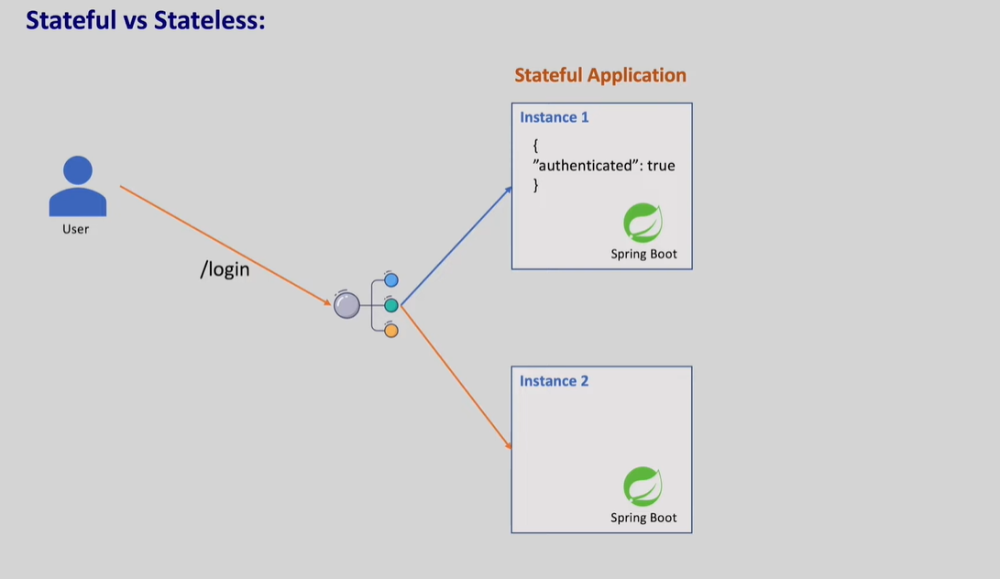
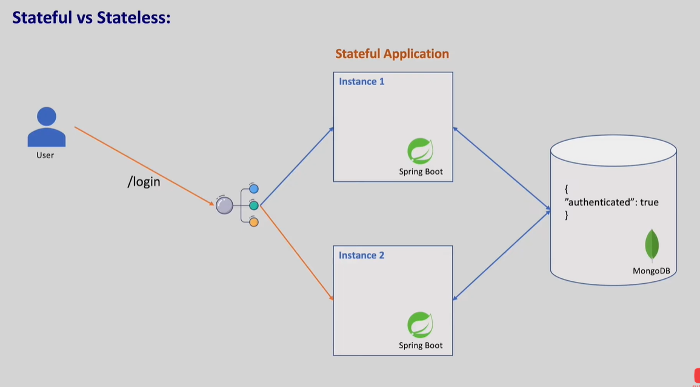
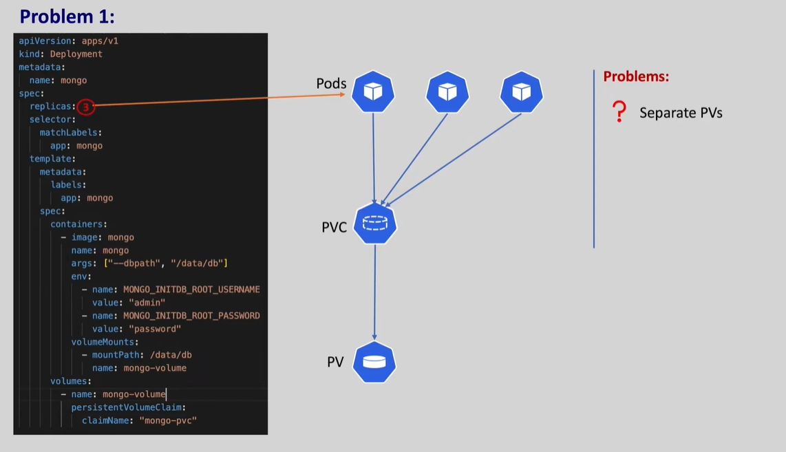
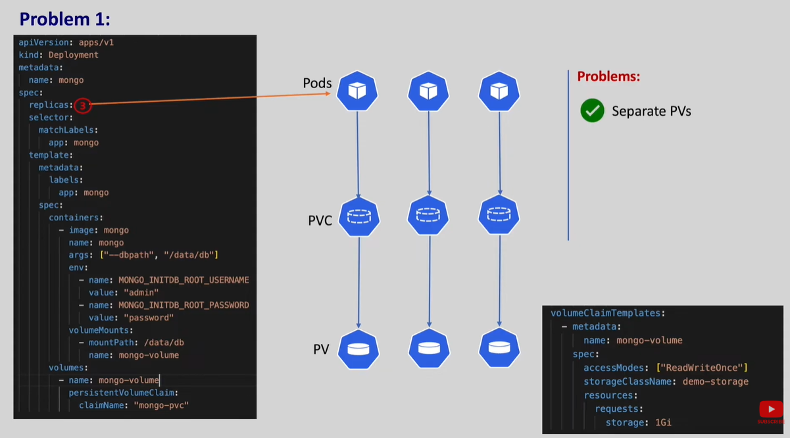
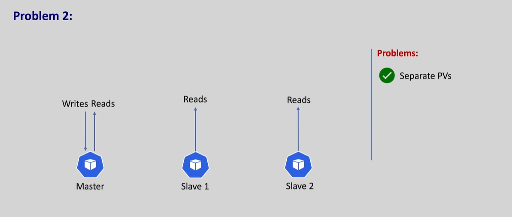
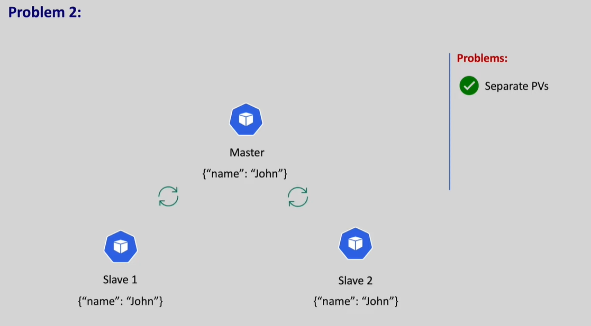
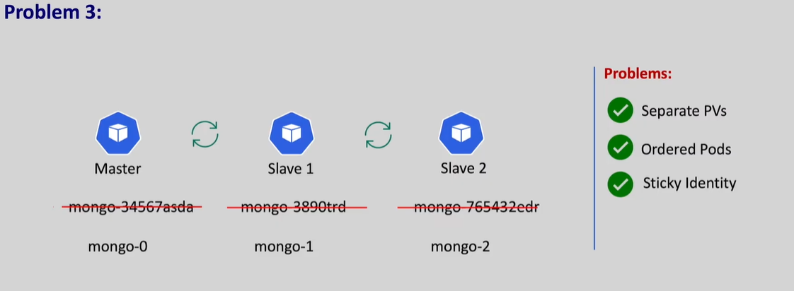
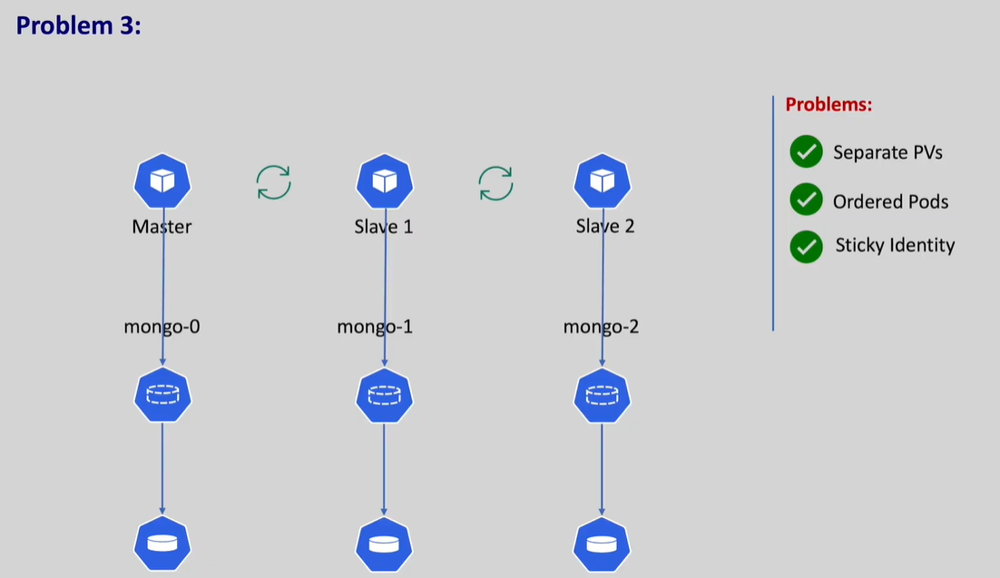
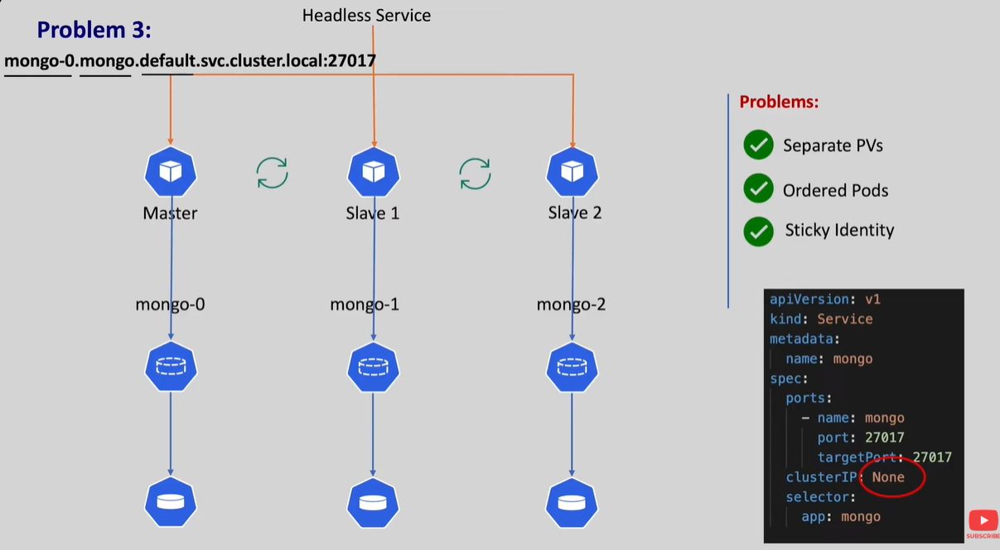
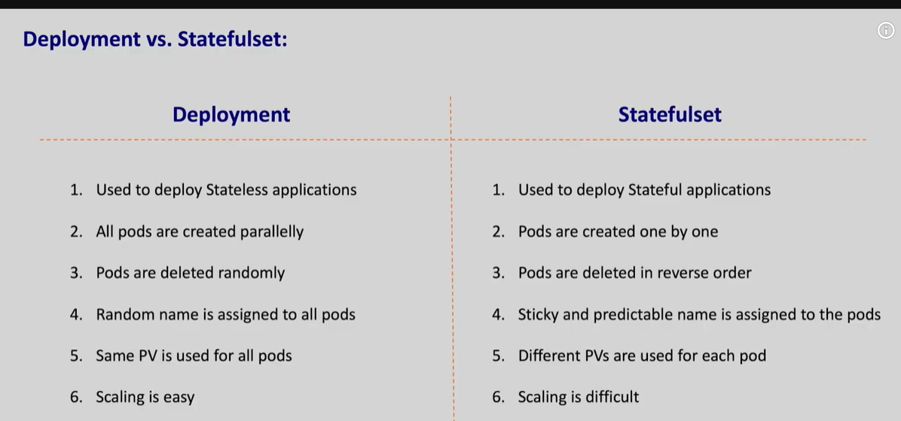

if there are multiple pods and multiple instances of the same pod with load balancer

# Problem -2

But if we use deployment resource to deploy this kind of application all the pods are created parallely if we deploy same application with stateful sets pods are created one by one.

If we have 3 replicas first pod-1 will be created and once the pod-1 is ready then second pod is created and once the second pod is ready then 3rd pod is created.

If the first pod fails to create for any reason second pod will not be craeted also if we delete the statefulset the last pod is deleted first

# Problem-3

Normally all the nodes in cluster should talk to each other for master replication for that we need a stick identity to find each other in the cluster if we use deployment it will come up with different random names.

To acheive this there should be a way to acheive a constant name for all the pods so even if the pod restarts it should get the same name

Also as discussed early Master should handle all the writes and Slaves should be able to sync with the master so if we use service it will talk to any pod for it requirements. So here we will use headless service to talk to the pod

So when we talk uisng dns the service automatically takes the request to the master instaed of slave. To create headless service we will keep clusterIp as None.

headless service are helpful when we don't want to amke any loadbalancing

