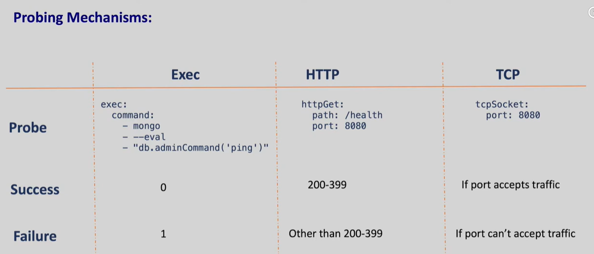
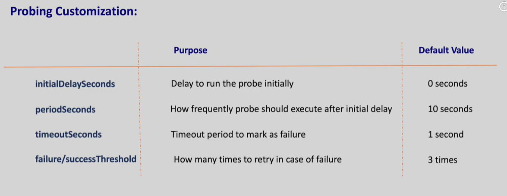
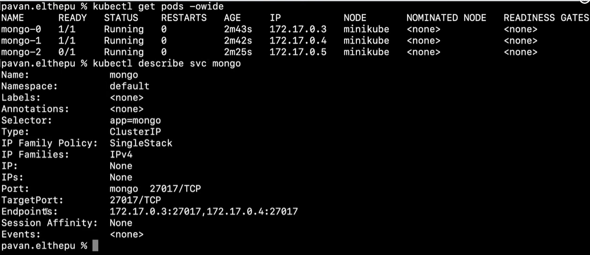
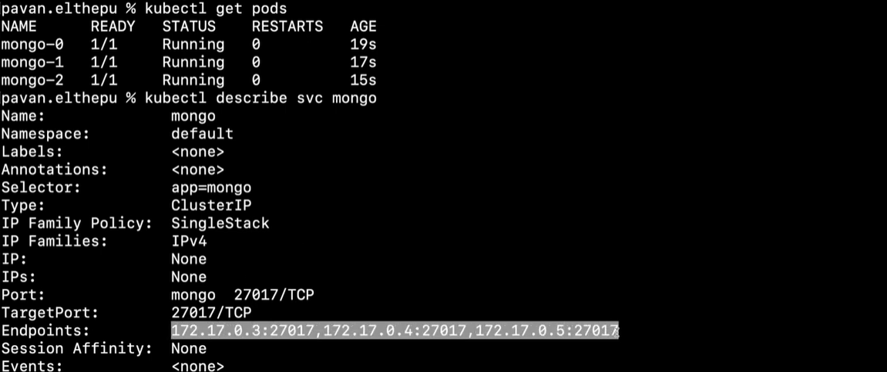
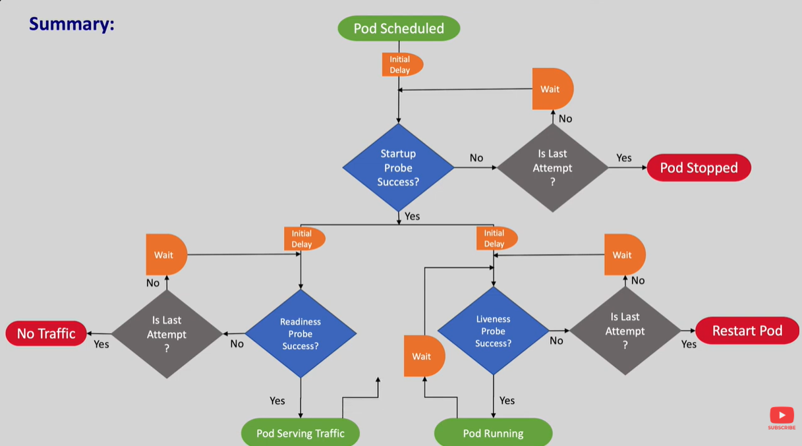

We will define probes at the container level and not the pod level

# Liveness Probe

Liveness probe: We can instruct kubernets to inspecat if the pod is live or not/healthy or not by passing commands or network inside a container. Liveness probe make sure we have the healthy pods available.

If the liveness probe gives the exit code as 1 it means failure, Kubernetes assumes pod as unhealthy and kubectl restarts the pod

# Readiness Probe

Readiness probe: This probe can identify if the container can receive external traffic from the service if readiness probe fails kubernetes will remove the ip address of all the services it belongs to.
This make sures that a container doesnot receive any traffic until it's ready

Note: Difference between them is When liveness probe is failed the container gets restarted whereas if readiness probe fails the container is not restarted it will be removed from the service endpoint so that it doesn't receive any traffic

# Startup probe

It has the way to delay the liveness and the Readiness. The Live/Ready probes are executed only after the startup probe succedss if the startup probe fails the container gets killed and follows the container restart Policy

Restart Policy - This defines when the pod should restart Restart policies are OnFailure, Always, never

