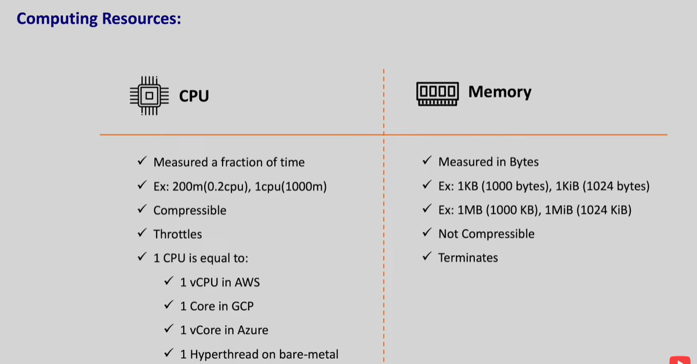
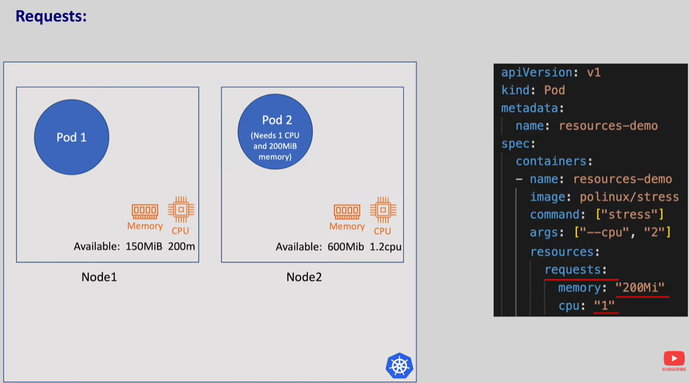
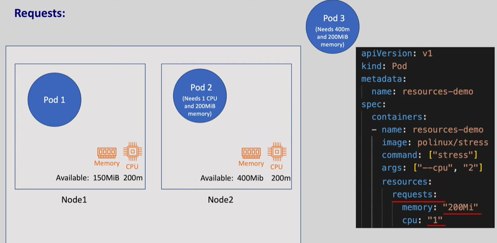
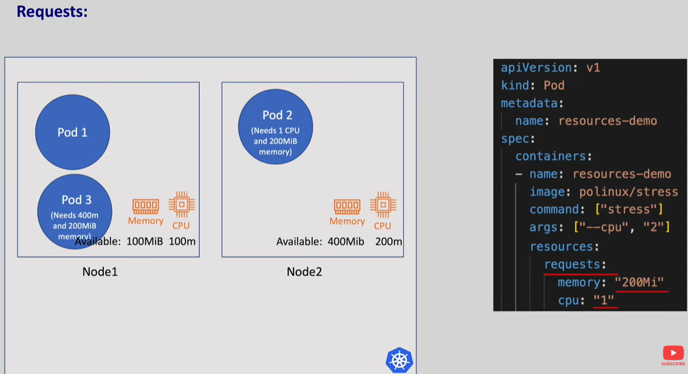
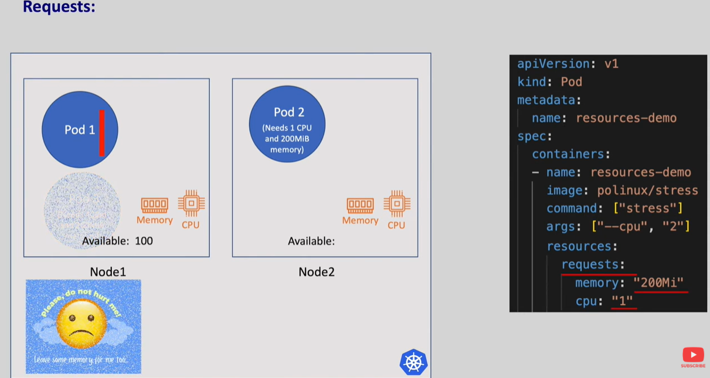
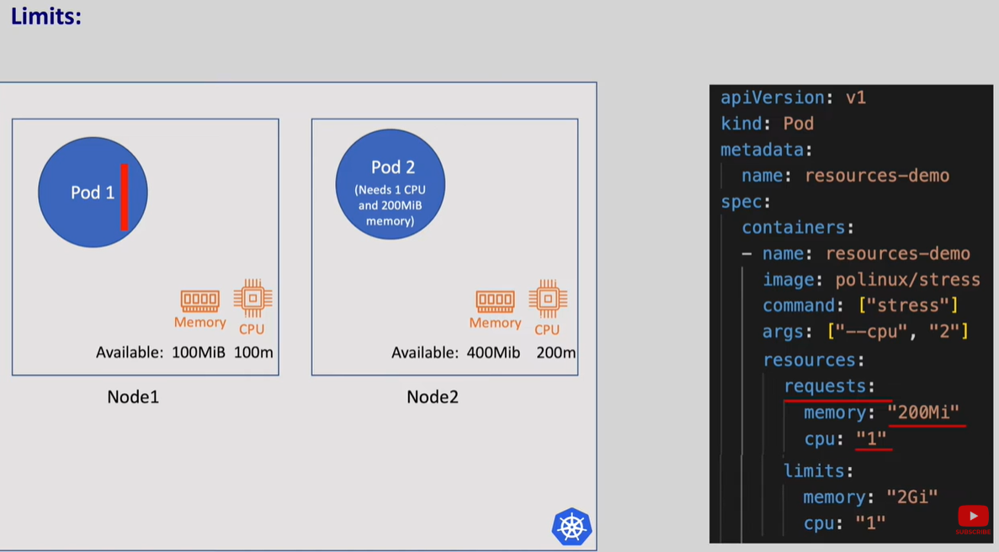
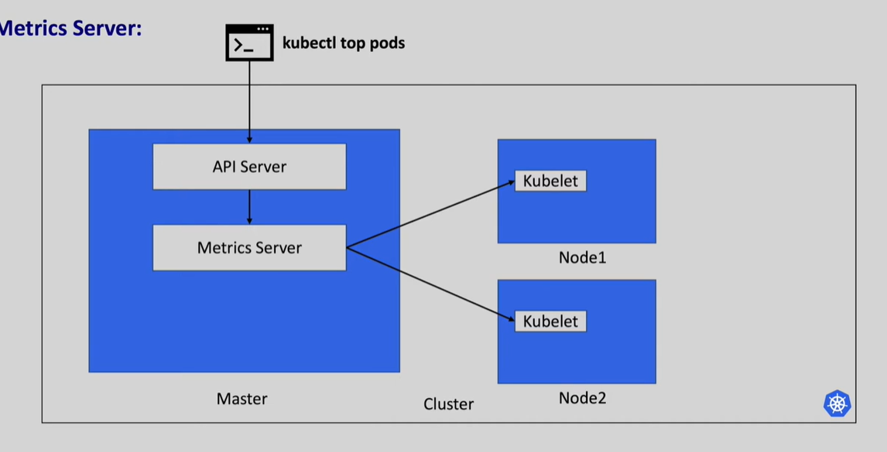
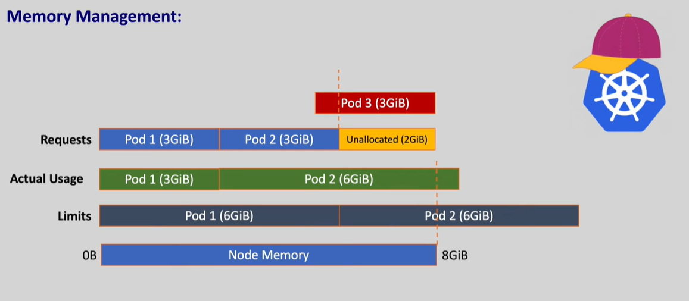
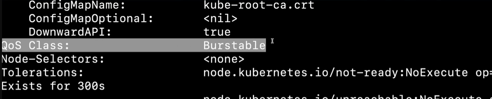

#Computing resources
Every node has resources like CPU, Memory and Disk Space CPU and Memory are called compute resources

IF CPU is compressible it means when the application is using maximum CPU it cuts down the CPU cycle and it slows down the response rate instaed of killing the process. Memory is not compresibble and when the menory is full it fails with OOM killed.

After the pod gets assigned to node-2 the alloctable resources in the node gets and when a new pod is waiting with the resources it aan't go any node. The pod lies in pending state

And the pod gets assigned to the node when the resources are available. When we have not given the CPU and the memory limit it meand we don't care how much CPU and Memory our Pod is taking and if there is any memory leak only one pod will get exceuted remaning all will be in pending state. if alraedy there is pod in the node then it will get terminated.

In kuberntes we can also limit the CPU and memor of a container and this can deone using limits in manifest

We can see how much resources a pod is consuming with kubectl top pods for this we need metric-api it will run default in all the nodes

# Memory mangment

We have a node with 8gb memory and two pods with limit 3gb, 3bg if there is another pod it will not be in the same node

overcommited state: And if the limit is more than node memory like 6gb, 6gb pod the kubernets can schedule pod on 8gb node because while scheduling it checks for requests an not limits

If one of the Pod in the 6gb consumes the entire 6gb which pod should be killed

Quality of service (QoS):

Kubernets decides the pod using the Quality of service class which is defined internally within kubernetes

Best effort class: If no requets and limits are defined to pod then class is Best Effort
As there is no limit kubernetes will delete the pod which has the Best effort Quality

Guaranteed class: If the requests and limts are same for both the pods then class is Guaranteed

burstable class: If the requests and limts are not same then pods will be in Burtsable class

if we describe the pod then we can get the class of the pod

Deletion priority: Best effort class > burstable class > Guaranteed class

# limit Range

If Administrator wants to control how many resources a pod can use maximum or the default requesta nd limits for all the pods we can use limit-resources

# Resource Quota

Sometime we want to apply the limit on namespace instaed of pod or container then we need to use Resource Quota
